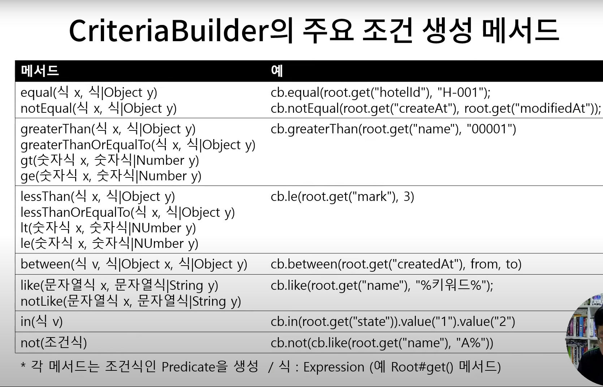

# JPA, Criteria
<b>Criteria</b>는 코드로 쿼리를 구성하는 API이다. JPQL 대신 자바 코드를 사용한다.   

예시 코드.
```
CriteriaBuilder cb = em.getCriteriaBuilder();
CriteriaQuery<Review> cq = cb.createQuery(Review.class);
Root<Review> root = cq.from(Review.class);

cq.select(root);
cq.where(cb.equal(root.get("hotelId"), "H-001"));
cq.orderBy(cb.asc(root.get("id")));

=> SELECT r FROM Review r WHERE r.hotelId = "H-001"

TypedQuery<Review> query = em.createQuery(cq);
query.setFirstResult(4); // 0부터 시작
query.setMaxResults(4);
List<Review> reviews = query.getResultList();
```

## 기본 사용법
* CriteriaBuilder 생성 (CB로 표현)
```
CriteriaBuilder cb = em.getCriteriaBuilder();
```
* CriteriaQuery 생성 (CQ로 표현, 파라미터는 쿼리 결과 타입)
```
CriteriaQuery<Review> cq = cb.createQuery(Review.class);
```
* CQ#from으로 from 절 엔티티 지정 (Root 타입 이용해서 엔티티 속성 접근)
```
Root<Review> root = cq.from(Review.class);
```
* CQ#select로 SELECT로 대상 지정
```
cq.select(root);
```
* CQ#where로 조건 지정 (CB를 이용해 Predicate 생성)
```
cq.where(cb.equal(root.get("hotelId"), "H-001"));
```
* CQ#orderBy로 정렬 순서 지정 (CB를 이용해 Order 생성)
```
cq.orderBy(cb.asc(root.get("id")));
```
* CQ를 이용해 TypedQuery 생성
```
TypedQuery<Review> query = em.createQuery(cq);
```

## 검색 조건 지정
* CQ#where 메소드에 검색 조건을 전달한다.
* 검색 조건은 CB를 이용해 생성한다. (예. 같음 조건은 CB#equal()로 생성)
* 검색 조건에 사용할 엔티티 속성은 Root#get() 메소드로 구한다.
```
Root<Review> root = cq.from(Review.class);

// 생성 조건 - Review의 hotelId가 "H-001"과 같음
Predicate predicate = db.equal(root.get("hotelId"), "H-001");

cq.where(predicate);
```
* 검색 조건은 조합이 가능하다.
    * CB#and, CB#or로 조건 조합
```
predicate p1 = cb.equal(root.get("hotelId"), "H-001");
predicate p2 = cb.greaterThan(root.get("created"), LocalDateTime.now().minusDays(10));

Predicate predicate = cb.and(p1, p2);

cq.where(predicate);
```

## 정렬 순서 지정
* CQ#order로 정렬 지정이 가능하다.
* CB#asc(), CB#desc()로 정렬 정보(Order)을 생성할 수 있다.
    * 정렬 대상 속성은 Root#get()으로 구한다.
```
Order orderId = cb.asc(root.get("id"));
cq.orderBy(orderId);
```
* 한 개 이상 정렬 지정이 가능하다.
```
cq.orderBy(
    cb.asc(root.get("hotelId")),
    cb.desc(root.get("id"))
);
```

## CriteriaBuilder 주요 조건 생성 메서드


## Root#get()과 Generic Type
* <Y>Path<Y> get(String attributeName)
* in() 조건을 생성할 때 타입 파라미터를 지정하면 유용하다.   

* mark 속성이 int 타입
    * 아래의 경우 Object로 선언했을 때, 런타임에 쿼리 생성 시점에 에러가 발생한다.
```
CriteriaBuilder.In<Object> markCond = cb.in(root.get("mark"));
markCond.value(1).value("a")
```

* mark 속성이 int 타입
    * 아래의 경우 Integer로 선언했을 때, 런타임 시점에 에러가 발생한다.
```
CriteriaBuilder.In<Integer> markCond = cb.in(root.<Integer>>get("mark"));
markCond.value(1).value("a")
```

쿼리 생성 시점에 에러가 발생하는 것보다 컴파일 시점에 에러가 발생하는 것이 낫다. 전달할 값을 수정하기만 하면 되기 때문에 쉽게 에러를 파악할 수 있고 수정이 더 쉽다.   

그리고 실제로는 get()으로 가져올 때 직접 입력하는 것이 아닌 파라미터가 따로 존재하며 이를 가져온다.   

## Criteria 사용 이점
Criteria 사용 이점은 동적인 검색 조건을 지정할 수 있다.   

예시코드.
```
Predicate p = cb.conjunction();

// hotelId가 존재한다는 조건
if (hotelId != null) {
    p = cb.and(p, cb.equal(root.get("hotelId"), hotelId));
}

p = cb.and(p, cb.greaterThan(root.get("created"), LocalDateTime.now().minusDays(10)));

// mark가 0 이상일 경우의 조건
if (mark >= 0) {
    p = cb.and(p, cb.get(root.get("mark"), mark));
}

cq.where(p);
```

## 자주 사용하지 않지만 존재하는 것들
* Join
* 집합 함수
    * COUNT, MAX, MIN, AVG, SUM
* GROUP BY, HAVING
* 콜렉션 관련 비교
    * member of, not member of, is empty, is not empty
    * exists, all, any
* JPA 함수
    * CONCAT, SUBSTRING, TRIM, ABS, SQRT
    * 콜렉션 함수
        * SIZE, INDEX...   

## 정리
주의할 것은 다음의 경우에는 Criteria가 아닌 일반 쿼리를 사용하는 것이 좋다.   

* 여러 테이블을 조인할 때
    * 레거시 테이블 조인
* DBMS에 특화된 쿼리 필요할 때
    * 예. 오라클 힌트
* 서브 쿼리가 필요할 때
* 통계, 대량 데이터를 조회하거나 처리할 때   

그 외에는 굳이 연관과 쿼리를 사용하고 싶다면 ```N+1 문제```, ```Fetch Join``` 추가 학습을 하는 것이 좋다. 그리고 다시 강조하는 것은 단순하지 않은 <b>목록 조회, 상세 조회</b>는 ```SQL```을 쓰는 것이 좋다. (=> CQRS)   

[Criteria](https://www.youtube.com/watch?v=ZAiH382rUF0)