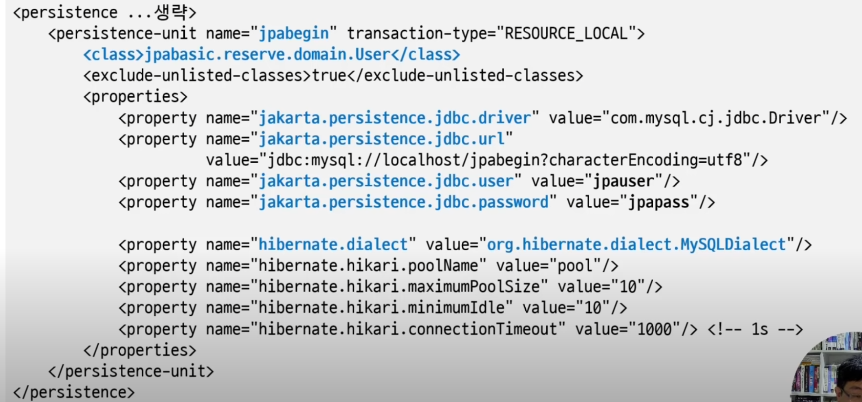

# JPA 일단 해보기

## JPA
<b>ORM (Object-Relational Mapping)</b> 스펙이다. 자바 객쳋와 관계형 데이터베이스 간 매핑 처리를 위한 API이다.   

* Java Persistence API (2.2 Ver)
* Jakarta Persistence API (3.0 Ver)
    * 2.2 Ver 부터 JCP는 잌르립스 재단으로 이관 진행
    * Jakarta EE 9 Ver는 JPA 3.0   

보통 JPA만 단독으로 사용하기 보다 스프링과 함께 사용하며 스프링 6 Ver 부터 Jakarta EE9+을 지원한다.   

## JPA 특징
<b>Annotation</b>을 이용한 매핑 설정이 간으하며 XML 파일을 이용한 매핑 설정도 가능하다. String, int, LocalDate 등 기본적인 타입에 대한 매핑을 지원한다. 그리고 커스텀 타입 변환기를 지원하며 예로 본인이 만든 Money 타입을 데이터 베이스 칼럼에 매핑이 가능하다. Value 타입 매핑 또한 지원하며 한 개 이상 칼럼을 한 개 타입으로 매핑이 가능하다.   

클래스 간 연관 지원은 다음과 같다.   
* 1 - 1
* 1 - N
* N - 1
* N - M   

그리고 상속에 대한 매핑을 지원한다.   

## JPA 사용 준비
MySQL을 준비한다.   
* 데이터베이스 생성
* 사용자 생성 및 권한 부여
```
create database jpabegin CHARACTER SET utf8mb4;

CREATE USER 'jpauser'@'localhost' IDENTIFIED BY 'jpapass';
CREATE USER 'jpauser'@'%' IDENTIFIED BY 'jpapass';

GRANT ALL PRIVILEGES ON 'jpabegin.* TO 'jpauser'@'localhost';
GRANT ALL PRIVILEGES ON 'jpabegin.* TO 'jpauser'@'%';
```
* 테이블 생성
```
create table jpabegin.user {
    email varchar(50) not null primary key,
    name varchar(50),
    create_date datetime
} engine innodb character set utf8mb4;
```

그리고 자바 프로젝트를 준비한다.   
* Maven
* pom.xml에 관련 의존 추가
```
<properties>
    ...
    <hibernate.version>6.0.0.final</hibernate.version>
</properties>

<dependencies>
    ...
    <dependency>
        <groupId>org.hibernate</groupId>
        <artifactId>hibernate-core</artifactId>
        <version>${hibernate.version}</version>
    </dependency>
    <dependency>
        <groupId>org.hibernate</groupId>
        <artifactId>hibernate-hikaricp</artifactId>
        <version>${hibernate.version}</version>
    </dependency>
    ...
</dependencies>
```
* persistence.xml (src/main/resources/META-INF) 파일 작성
    
    ```
    <persistence-unit name="jpabegin transaction-type="RESOURCE_LOCAL>
    의 name은 영속 단위 (영속성 관리 단위) 이름

    <class>jpabasic.reserve.domain.User</class>
    는 매핑 클래스

    name="jakarta.persistence.jdbc.driver"
    name="jakarta.persistence.jdbc.url"
    name="jakarta.persistence.jdbc.user"
    name="jakarta.persistence.jdbc.password"
    부분은 데이터 베이스 ㅇ녀결 설정

    name="hibernate.dialect" value="org.hibernate.dialect.MySQLDialect"
    는 하이버네이트 데이터 베이스 종류 설정
    그 밑의 네 가지 속성은 커넥션풀 설정
    ```
* User 클래스 생성 및 작성
```
@Entity // 데이터베이스 테이블과 매핑 대상
@Table(name="user") // user 테이블과 매핑
public class User {

    @Id // 식별자에 대응 (Primary Key). 중복 불가
    private String email; // email 칼럼과 매핑

    private String name; // name 칼럼과 매핑

    @Column(name="create_date") // create_date 칼럼과 매핑
    private LocalDateTime createDate;

    protected User() {

    }

    public User(String email, String name, LocalDateTime createDate) {
        this.email = email;
        this.name = name;
        this.createDate = createDate;
    }

    ...
    Get 메소드
    ...
}
```
* Main 클래스 작성
```
EntityManagerFactory emf = Persistence.createEntityManagerFactory("jpabegin");
EntityManager entityManager = emf.createEntityManager();
EntityTransaction transaction = entityManager.getTransaction();

try {
    transaction.begin();
    // 임의로 데이터 추가
    User user = new User("user@user.com", "user", LocalDateTime.now());
    entityManager.persist(user);
    transaction.commit();
} catch(Exception e) {
    e.printStackTrace();
    transaction.rollback();
} finally {
    entityManager.close();
}

emf.close();
```
* 실행   

만약 유저가 존재하는지 확인하기 위한 임의의 방법은 다음과 같다.   

* UserGetMain 클래스
```
EntityManagerFactory emf = Persistence.createEntityManagerFactory("jpabegin");
EntityManager entityManager = emf.createEntityManager();
EntityTransaction transaction = entityManager.getTransaction();

try {
    transaction.begin();
    User user = entityManager.find(User.class, "user@user.com");
    if (user == null) {
        System.out.println("User 존재하지 않음");
    } else {
        System.out.printf("User 존재: email=%s, name=%s, createDate=%s\n", user.getEmail(), user.getName(), user.getCreateDate());
    }
    transaction.commit();
} catch(Exception e) {
    e.printStackTrace();
    transaction.rollback();
} finally {
    entityManager.close();
}

emf.close();
```

만약 유저 정보를 수정할 때 임의의 방법은 다음과 같다.   

* User 클래스에서 메소드 추가
```
public void changeName(String newName) {
    this.name = newName;
}
```

* UserUpdateMain 클래스
```
EntityManagerFactory emf = Persistence.createEntityManagerFactory("jpabegin");
EntityManager entityManager = emf.createEntityManager();
EntityTransaction transaction = entityManager.getTransaction();

try {
    transaction.begin();
    User user = entityManager.find(User.class, "user@user.com");
    if (user == null) {
        System.out.println("User 존재하지 않음");
    } else {
        String newName = "이름" + (System.currentTimeMilles() %s 100);
        user.changeName(newName);
    }
    transaction.commit();
} catch(Exception e) {
    e.printStackTrace();
    transaction.rollback();
} finally {
    entityManager.close();
}

emf.close();
```

## 정리
JPA로 간단한 설정으로 클래스와 테이블 간 매핑 처리가 가능하다. EntityManager를 이용해서 데이터 베이스 연동을 처리할 수 있다. 객체 변경만으로 데이터 베이스 테이블을 업데이트할 수 있으며 쿼리 작성을 직접할 필요가 없다.   

[JPA 일단 해보기](https://www.youtube.com/watch?v=Zwq2McbFOn4)