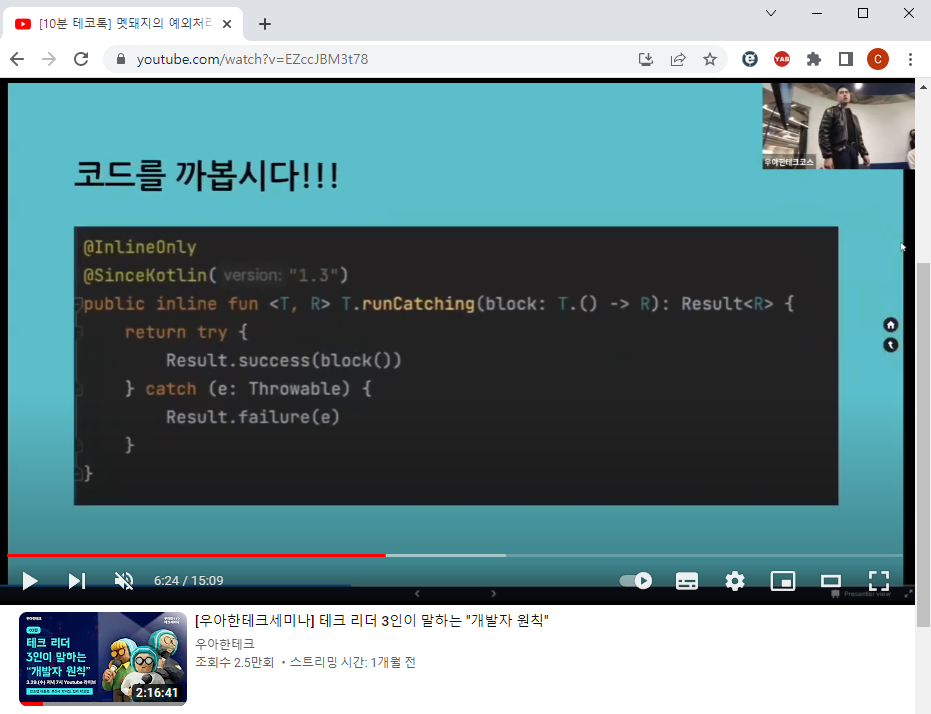

# 유튜브 영상 고정
유튜브를 시청할 때, 스크롤을 움직이면 상단에 동영상이 고정이 됩니다.   

이 확장 프로그램의 장점은 스크롤을 내려도 영상을 계속해서 시청할 수 있다는 것입니다.   

그러나 단점도 있습니다. 스크롤을 움직여서 동영상의 위치가 상단에 고정이 되면, 영상의 제목, 설명을 확인할 수 없습니다. 영상의 제목과 설명을 확인하기 위해서는 다시 스크롤을 상단으로 이동해야 합니다.   

