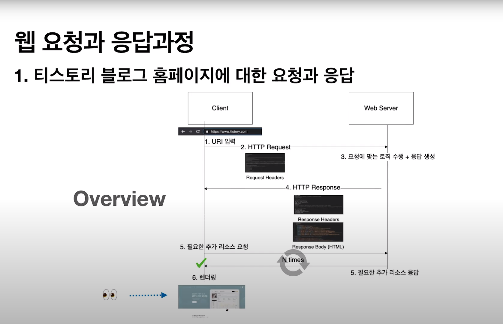

# Web 요청과 응답 과정

## 내용에 들어가기 전
* 인터넷: 컴퓨터 네트워크들을 서로 연결 지어주는 범지구적 네트워크이며, 거대한 네트워크 위에서 오늘날 우리가 사용하는 다양한 서비스가 동작한다. (웹도 인터넷 위에서 동작하는 서비스들 중 하나)   

## Web (웹)
빠르게 발전하고 있던 인터넷과 HyperText와 같은 새롭게 떠오르는 컴퓨터 기술들을 활용하여 문제점을 해결하고자 했으며, 그로 인해 탄생한 것이 Web. 즉, 웹이 탄생하였다.   

```웹의 존재 이유는``` 정보(자원)의 공유를 위함이며, 수많은 요청과 응답 사이클의 연속으로 이루어져 있다.   

그리고 공유 과정에 참여하는 주체들이 있다.

### 서버와 클라이언트
* 서버: 정보, 자원, 서비스를 제공하는 측. 용청을 받고 응답을 하는 측.
* 클라이언트: 정보, 자원, 서비스를 사용하는 측. 요청을 보내는 측.   

### HTTP (HyperText Transfer Protocol)
웹 요청과 응답에 관한 클라이언트와 서버 사이의 규약이다. (HTTPS는 보완이 강화된 버전이다.)   

#### HTTP 특성
1. 비연결성   
클라이언트의 요청에 대해 서버가 응답을 마치면 연결을 끊는다. 다음 요청은 새로운 연결을 통해 이루어진다.   

그러나 단점이 있다. 매번 모든 요청에 대해 새로운 연결과 해제 과정을 거치므로 ```네트워크 비용 측면에서 비효율적```이다. 이를 보완하기 위해 <b>HTTP/1.1 Keep-Alive</b>로 서버와 클라이언트 사이에서 통신이 없어도 지정된 시간동안 연결을 <b>유지</b>하는 기능을 사용한다.   

2. 무상태 (Stateless)
서버와 클라이언트는 하나의 요청이 진행되는 동안만 서로를 인지한다.   

그러나 무상태도 단점이 있다. 클라이언트 인증(로그인)이 필요한 서비스에서는 사용하기 불편하다. 이를 보완하기 위해 쿠키와 세션, 토큰(oAuth, JWT) 등 상태를 기억하기 위한 기능들을 사용한다.   

#### HTTP Status Code (응답 코드, 상태 코드)
클라이언트의 요청에 대해 서버는 <b>요청에 대한 처리 상태</b>를 <b>숫자 코드</b>로 반환한다. (예. 200: 서버가 요청을 제대로 처리했을 때, 404: 요청한 페이지를 찾을 수 없을 때)   

* 100번 대: (정보) 요청을 받았으며 프로세스를 계속한다.   
* 200번 대: (성공) 요청을 성공적으로 받았으며 인식해서 처리했다.   
* 300번 대: (리다이렉션) 요청 완료를 위해 추가 작업 조치가 필요하다.   
* 400번 대: (클라이언트 에러) 요청의 문법이 잘못되었거나 요청을 처리할 수 없다.   
* 500번 대: (서버 에러) 서버가 명백히 유효한 요청에 대해 충족을 실패했다.   

#### HTTP Method (verbs)
클라이언트가 요청을 보낼 때, 해당 요청의 <b>목적</b>이 무엇인지 HTTP Method를 통해 명시한다.   

* GET: 서버의 리소스를 조회하고자 할 때 (READ)
* POST: 서버에 리소스를 생성하고자 할 때 (CREATE)
* PUT: 서버의 리소스를 수정할 때 (UPDATE)
* DELETE: 서버의 리소스를 삭제할 때 (DELETE)   

이 외 여러 가지가 있으나 위의 네 가지가 자주 쓰인다.   

## 웹 요청과 응답 과정
* 이동하고 싶은 홈페이지에 대한 요청과 응답 (예. 네이버, https://www.naver.com 입력 후 Enter)   
   
1. URL (Uniform Resource Locator, 네트워크상 자원의 위치(주소))   

```
https://www.exampleurl.com/info/aboutus.html

https - 프로토콜
www - Third-level 도메인, 서브도메인 네임
exampleurl - Second-level 도메인
com - Top-level 도메인
/info - 디렉토리
/aboutus.html - 파일, 페이지

exampleurl.com - 도메인 네임
www.exampleurl.com - 호스트 네임
/info/aboutus.html - Path
```

2. 홈페이지에 대한 요청을 서버로 전송 (HTTP Request)   
* Method: GET 타입, POST 타입
* Accept: 어떤 타입의 응답 컨텐츠를 수용할 수 있는가.
* User-agent: 어떤 운영체제와 어떤 브라우저를 사용하고 있는가.
* Cookie: 상태 기억을 위한 정보   

3. 서버가 클라이언트로부터 요청을 받고 처리   
* Request Headers 확인하기   
<b>요청</b>에 대한 정보(URL, Method 등)과 <b>클라이언트</b>에 대한 정보 (Accept, User-agent, Cookie 등)   

* 요청에 상응하는 로직 수행   
홈페이지(www.naver.com)에 해당하는 html 파일을 찾은 후에 요청에 대한 <b>응답 생성</b>   

4. 서버가 클라이언트에게 응답 (HTTP Response)   
Response Headers와 Response Body (HTML)에서 확인할 수 있다.   

5. 클라이언트 (웹 브라우저)가 응답을 받은 후에 필요한 리소스들을 추가 요청하거나 응답을 받기   
CSS, Javascript 등을 요청한다.   

6. 클라이언트 (웹 브라우저)가 모든 리소스 요청에 대한 응답을 받기   

위의 과정을 이미지를 통해 확인할 수 있다.   

   

[Web 요청과 응답 과정 출처](https://www.youtube.com/watch?v=0jV7xOUcKog)